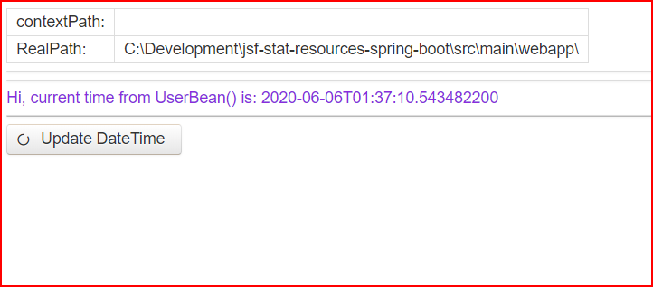

= Pet Project to test *.js from Primefaces
To demonstrate minimal start up Spring Boot + JSF + Primefaces. No more.

[green]#copyleft:  _Iakov Senatov 05.2021._#

JSF-Mojarra 2.4, PrimeFaces 8.0, Spring Boot 2.4.RELEASE, Lombok etc

- Java 15, JSF2 Mojarra 2.4 (Glasfish),
- Spring App (Tomcat 9),
- Spring Boot 2.4.4.RELEASE,
- PrimerFaces

== Example of using static resources

by spring boot web App

|===
|Libs | Ver

|[blue]*Spring Boot*
|[red]*2.4.RELEASE*

|[blue]*JSF*
|[green]*Mojarra 2.4.4*

|[blue]*JDK*
|[red]*Zulu OpenJDK 15*

|[blue]*PrimeFaces*
|[red]*8.0*

|===

*Paths:*

|===
|*path are:* | *description* |*remarks*

|http://localhost:18085/ui
| [gray]*xxx*
| [gray]*xxxx*

|===

mailto://javaentwickler@gmail.com[EMail]
